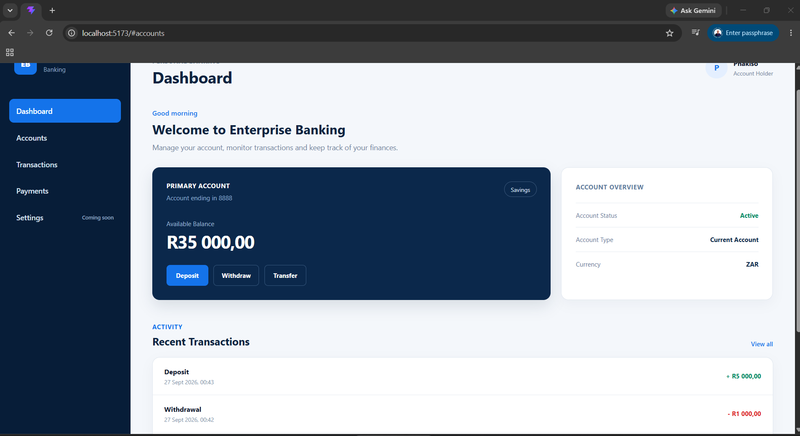
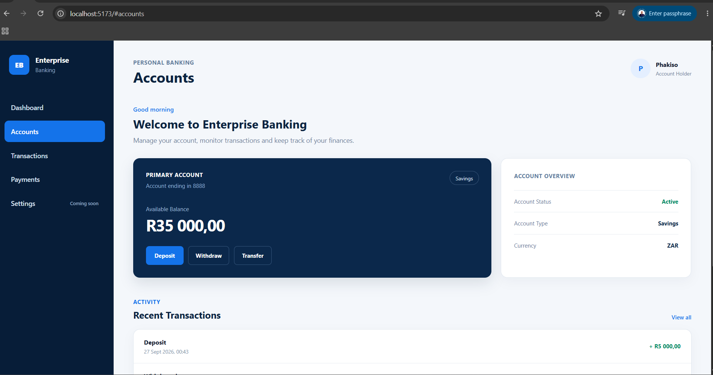
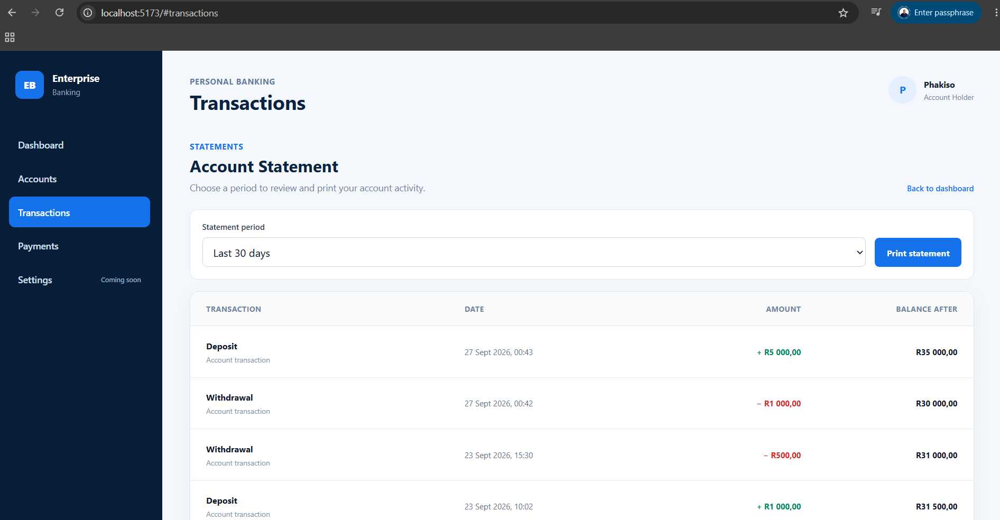
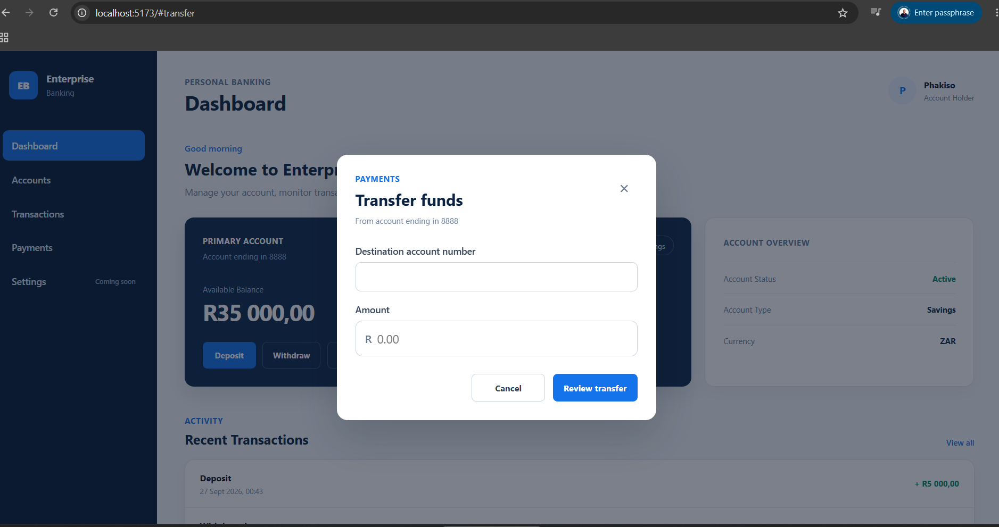
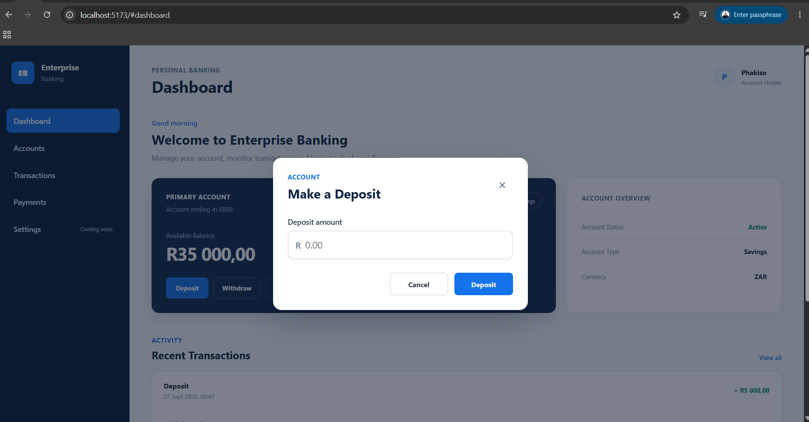
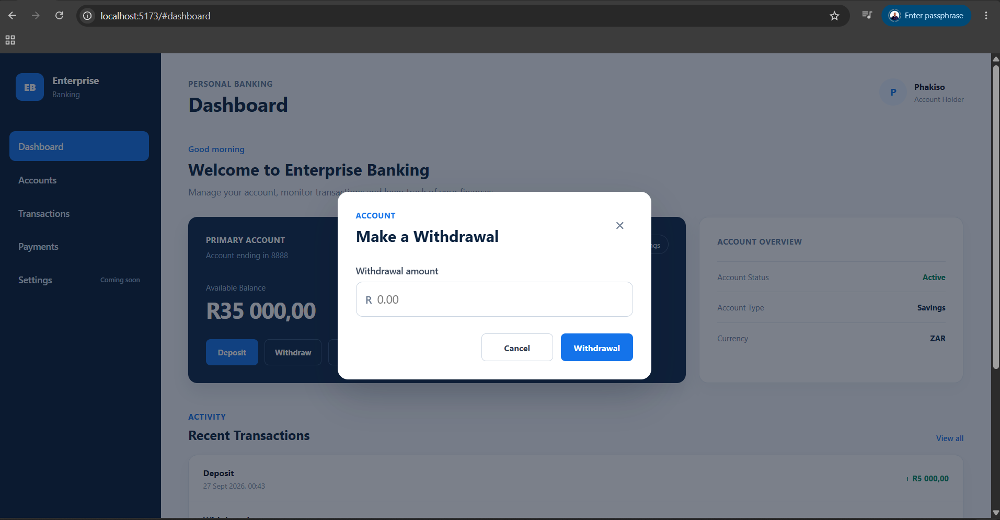
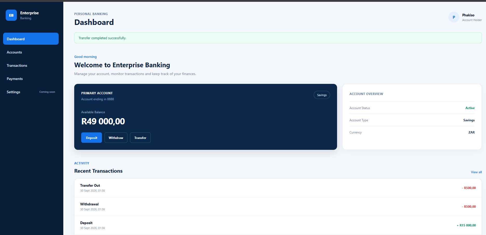

# Enterprise Banking Web

Responsive React and Vite dashboard for viewing account balances and transaction activity, making deposits and withdrawals, printing statements, and transferring funds.

## Configuration

Create a local `.env.local` file for development:

```dotenv
VITE_API_BASE_URL=http://localhost:8080/api/v1
VITE_ACCOUNT_NUMBER=your-account-number
```

The API URL defaults to the local development server while running Vite. Production builds require `VITE_API_BASE_URL` and `VITE_ACCOUNT_NUMBER` to be set in the deployment environment. Only non-secret configuration belongs in `VITE_` variables because Vite includes them in the browser bundle.

## Run locally

```sh
npm install
npm run dev
```

## Verification

```sh
npm test
npm run lint
npm run build
```

`npm test` runs the Node.js built-in tests for statement period filtering and transfer input validation. The production build is written to `dist/`.

## Banking API

The web app reads account details and transaction history from the configured API. Deposits and withdrawals use the account action endpoints. Transfers use:

```http
POST /api/v1/accounts/{sourceAccountNumber}/transfers
Content-Type: application/json

{
  "destinationAccountNumber": 123456,
  "amount": 250.00
}
```

The API records a debit on the source account and a credit on the destination account in one database transaction. The statement period is filtered from the account transaction history returned by the API; printing opens the browser’s print dialog for the selected period.

## UI Screenshots

The screenshots below show the banking dashboard and its core account and transaction flows.

### Dashboard



### Accounts



### Transaction history



### Transfer funds



### Deposit



### Withdrawal



### Dashboard after transfer


